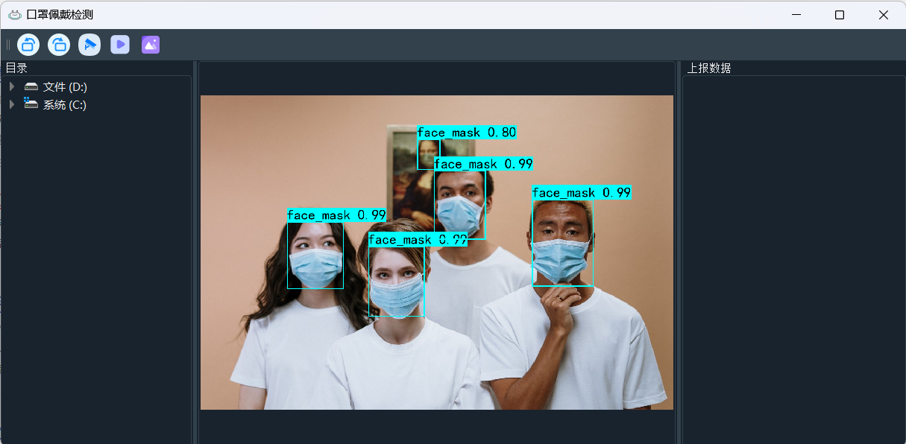

<!--
 * @Description: 
 * @Author: Egrt
 * @Date: 2021-05-08 15:27:48
 * @LastEditors: Egrt
 * @LastEditTime: 2023-03-10 18:34:50
-->
## PyQt5实现目标检测系统搭建——支持多线程
---

## 功能
1. 支持读取本地图片
2. 支持读取本地视频
3. 支持打开摄像头实时检测
4. 支持多线程，防止卡顿
5. 支持检测到人脸未佩戴口罩时记录，并语音警告

## 所需环境
torch==1.2.0
PyQt5==5.15.7
pygame==2.2.0

## 文件下载
训练所需的权值可在百度网盘中下载。   
链接: https://pan.baidu.com/s/1gSC4jYYpMfWl90zTK0dI4w    
提取码: x39a     

## 运行
运行根目录下**main.py**启动界面：
